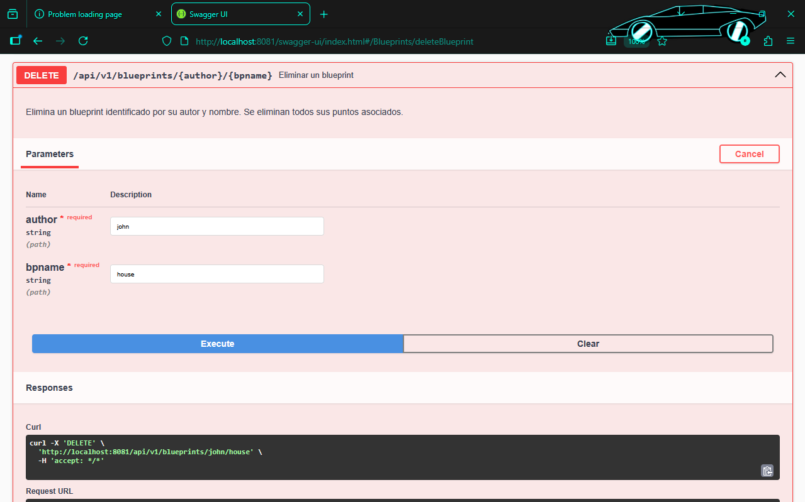
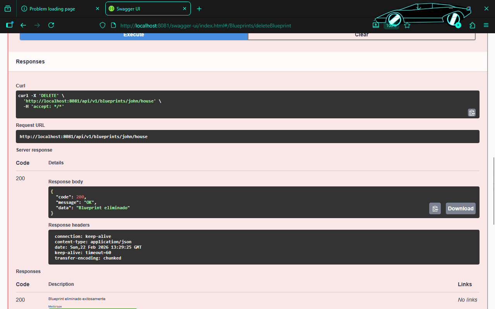
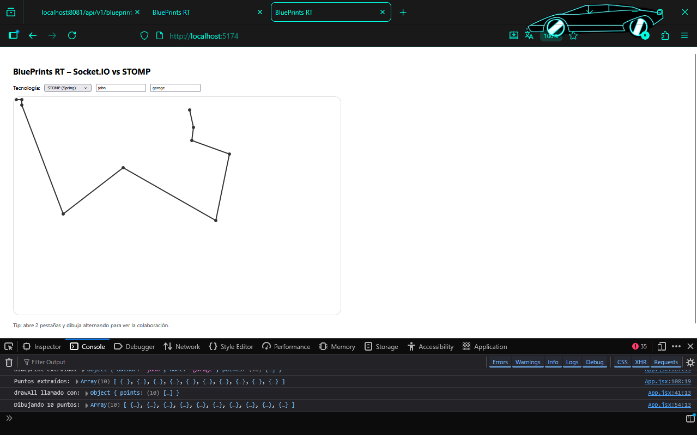
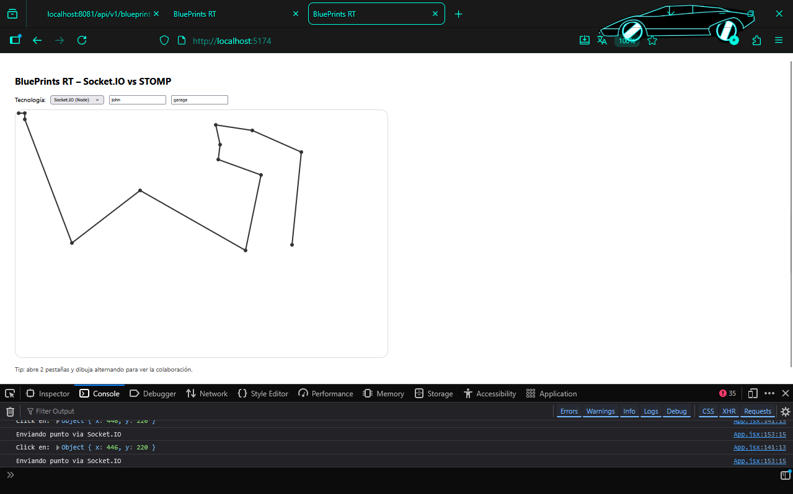

# Laboratorio ARSW

## CRUD
Para el crud desde el laboratoio anterior ya se habia implementado create, update y varias consultas, sin embargo no se habia implementado el delete

Para el desarrollo del delete 
- En `BlueprintsAPIController.java` agregamos el end point 
- En `BlueprintsServices.java` agregamos el metodo de servicio que delega la peticion
- En `PostgresBlueprintPersistence.java` es donde implementamos el metodo, con el scrip SQL para poder eliminarlo
- En `BlueprintPersistence.java` confirmamos la aliminacion





---

## Backend STOMP

**Repos guía:** https://github.com/DECSIS-ECI/example-backend-stopm/tree/main

**Características:**
- WebSocket sobre STOMP
- Tópicos por plano: `/topic/blueprints.{author}.{name}`
- Acumula puntos en memoria

**Protocolo:**

| Dirección | Destino | Payload |
|-----------|---------|---------|
| Client → Server | `/app/draw` | `{author, name, point:{x,y}}` |
| Server → Clients | `/topic/blueprints.{author}.{name}` | `{author, name, points:[...]}` |

**Configuración (pom.xml requerida):**
```xml
<dependency>
  <groupId>org.springframework.boot</groupId>
  <artifactId>spring-boot-starter-websocket</artifactId>
</dependency>
```

**Setup:** Ver repositorio guía para @Configuration y @MessageMapping.

---

### 3Backend Socket.IO (Puerto 3001) — Node.js

**Repos guía:** https://github.com/DECSIS-ECI/example-backend-socketio-node-/blob/main/README.md

**Características:**
- WebSocket con Socket.IO
- Salas por plano: `blueprints.{author}.{name}`
- Acumula puntos en memoria

**Protocolo:**

| Evento | Dirección | Payload |
|--------|-----------|---------|
| `join-room` | Client → Server | `blueprints.{author}.{name}` |
| `draw-event` | Client → Server | `{room, author, name, point:{x,y}}` |
| `blueprint-update` | Server → Clients | `{author, name, points:[...]}` |

**Setup (package.json):**
```json
{
  "dependencies": {
    "express": "^4.18.0",
    "socket.io": "^4.5.0"
  }
}
```

---

## Interfaz Gráfica

### Screenshot STOMP (Puerto 8080)


**Features mostradas:**
- Selector de tecnología: **STOMP**
- Canvas dibujable
- Entrada de autor y plano
- Panel de estado

### Screenshot Socket.IO (Puerto 3001)


**Features mostradas:**
- Selector de tecnología: **Socket.IO**
- Canvas dibujable
- Entrada de autor y plano
- Panel de estado

---

## Puesta en Marcha

### Paso 1: Base de datos PostgreSQL
```bash
# Usando Docker
docker-compose up -d

# Verifica conexión
docker ps  # blueprints-postgres debe estar corriendo
```

### Paso 2: REST API CRUD (este proyecto, Puerto 8081)
```bash
cd Lab_P4_BluePrints
mvn spring-boot:run
# Swagger UI: http://localhost:8081/swagger-ui.html
```

### Paso 3: Backend STOMP (Puerto 8080)
```bash
cd ../Lb4-backend-stopm
mvn spring-boot:run
# WS endpoint: ws://localhost:8080/ws-blueprints
```

### Paso 4: Backend Socket.IO (Puerto 3001)
```bash
cd ../example-backend-socketio-node
npm install
npm run dev
# Server: http://localhost:3001
```

### Paso 5: Frontend React (Puerto 5173)
```bash
# En otro terminal, con las variables de entorno correctas
cd ./frontend
npm install
npm run dev
# http://localhost:5173
```

**Variables de entorno (.env.local en frontend):**
```
VITE_API_BASE=http://localhost:8081
VITE_STOMP_BASE=http://localhost:8080
VITE_IO_BASE=http://localhost:3001
```

## Integración

### Frontend 
```javascript
const response = await fetch(`${API_BASE}/api/v1/blueprints/${author}/${name}`);
const { data: blueprint } = await response.json();
setBlueprint(blueprint);
drawAll(blueprint.points);
```

### Frontend - STOMP 
```javascript
import { StompJs } from '@stomp/stompjs';

const client = new StompClient({
  brokerURL: STOMP_BASE + '/ws-blueprints',
  onConnect: () => {
    client.subscribe(`/topic/blueprints.${author}.${name}`, (msg) => {
      const { points } = JSON.parse(msg.body);
      drawAll(points);
    });
  }
});

// Enviar punto
client.publish({
  destination: '/app/draw',
  body: JSON.stringify({ author, name, point: {x, y} })
});
```

### Frontend - Socket.IO
```javascript
import { io } from 'socket.io-client';

const socket = io(IO_BASE, { transports: ['websocket'] });

socket.emit('join-room', `blueprints.${author}.${name}`);

socket.on('blueprint-update', ({ points }) => {
  drawAll(points);
});

// Enviar punto
socket.emit('draw-event', {
  room: `blueprints.${author}.${name}`,
  author, name,
  point: { x, y }
});
```

---

## Comparativa

| Aspecto | Socket.IO | STOMP |
|---------|-----------|-------|
| **Framework** | Node.js | Spring Boot |
| **Protocolo** | WebSocket + fallbacks | WebSocket |
| **Rooms** | Nativas (`.to(room)`) | Tópicos (`/topic/...`) |
| **Latencia** | Típicamente < 100ms | Típicamente < 150ms |
| **Escalabilidad** | Adapter Redis recomendado | Message broker (RabbitMQ) |
| **Complejidad** | Baja | Media (Spring config) |
| **Documentación** | Excelente | Buena |
| **Fallback** | HTTP long-polling | N/A (WebSocket only) |


---

## Video

**Video YouTube (colaboración en tiempo real):**  
> [**Insertar URL de YouTube aquí**](https://www.youtube.com/watch?v=...)


---

## Decisiones de Diseño

### 1. Acumulación de puntos en BD vs Memoria
- **DECISIÓN:** REST API acumula en **PostgreSQL**; Backends RT acumulan en **memoria**.
- **RAZÓN:** Persistencia para CRUD; memoria para RT (rápido, aislado por sesión).
- **Trade-off:** Si el backend RT reinicia, se pierden puntos no persistidos. Solución: periodicidad guardar en BD.

### 2. Topología de salas/tópicos
- **DECISIÓN:** `blueprints.{author}.{name}`
- **RAZÓN:** Aislamiento por plano; no hay colisiones entre usuarios.

### 3. Filtros de puntos (UndersamplingFilter, RedundancyFilter)
- **DECISIÓN:** Aplicar en `getBlueprint()` para consultas GET; *no* aplicar en broadcast RT.
- **RAZÓN:** GET es para visualización final; RT es incremental (punto a punto).

### 4. Formato de respuesta API
- **DECISIÓN:** Envolver en `{code, message, data}`
- **RAZÓN:** Consistencia; manejo uniforme de errores en front.

---

## Seguridad Implementada

**CORS habilitado** en WebConfig  
**Validación de entrada** en contratos (Blueprint, Point)  
**Manejo de excepciones** (`BlueprintNotFoundException`, `BlueprintPersistenceException`)  
**Sin autenticación** (fuera de alcance, pero se recomienda JWT para producción)  
**Sin autorización** (usuario puede acceder a cualquier plano)

---

## Estructura de Carpetas (Backend REST)

```
Lab_P4_BluePrints/
├── src/main/java/edu/eci/arsw/blueprints/
│   ├── BlueprintsApplication.java
│   ├── config/
│   │   ├── OpenApiConfig.java (Swagger)
│   │   └── WebConfig.java (CORS)
│   ├── controllers/
│   │   └── BlueprintsAPIController.java (REST endpoints)
│   ├── dto/
│   │   └── ApiResponse.java (wrapper de respuesta)
│   ├── filters/
│   │   ├── BlueprintsFilter.java (interfaz)
│   │   ├── IdentityFilter.java (sin cambios)
│   │   ├── RedundancyFilter.java (reduce duplicados)
│   │   └── UndersamplingFilter.java (1 de cada 2)
│   ├── model/
│   │   ├── Blueprint.java
│   │   └── Point.java (record)
│   ├── persistence/
│   │   ├── BlueprintPersistence.java (interfaz)
│   │   ├── BlueprintNotFoundException.java
│   │   ├── BlueprintPersistenceException.java
│   │   ├── InMemoryBlueprintPersistence.java
│   │   └── PostgresBlueprintPersistence.java
│   └── services/
│       └── BlueprintsServices.java
├── src/main/resources/
│   └── application.properties (DB config)
├── src/test/java/...
├── docker-compose.yml (PostgreSQL)
├── Dockerfile
└── pom.xml
```


---

## Repositorios Referencia

- **REST API (este):** Lab_P4_BluePrints  
- **STOMP (Spring):** https://github.com/DECSIS-ECI/example-backend-stopm/tree/main  
- **Socket.IO (Node):** https://github.com/DECSIS-ECI/example-backend-socketio-node-/blob/main/README.md

---

## Referencias Adicionales

- Spring Boot WebSocket: https://spring.io/guides/gs/messaging-stomp-websocket/
- Socket.IO Docs: https://socket.io/docs/
- PostgreSQL & Spring Data: https://spring.io/guides/gs/accessing-data-postgresql/

---

1. STOMP es más integrado con Spring pero requiere configuración de broker.
2. Socket.IO es más simple para tiempo real pero requiere servidor Node aparte.
3. La acumulación de puntos en BD (REST) + memoria (RT) funciona bien si se sincroniza periódicamente.
4. Latencia típica < 200ms en red local; varia con topología en prod.


